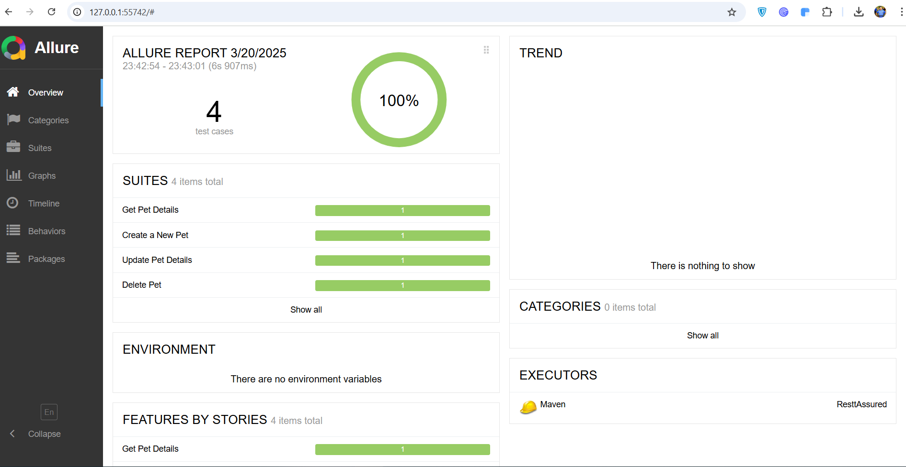
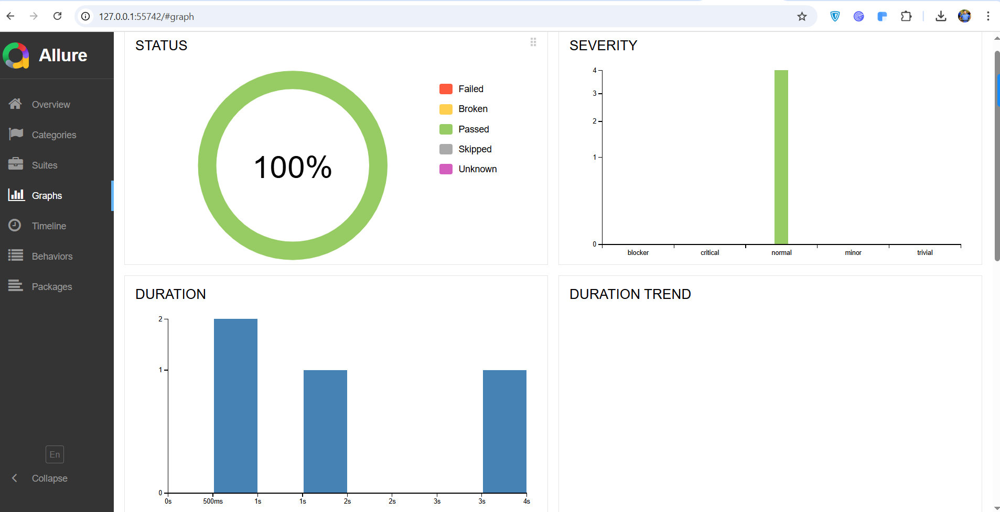
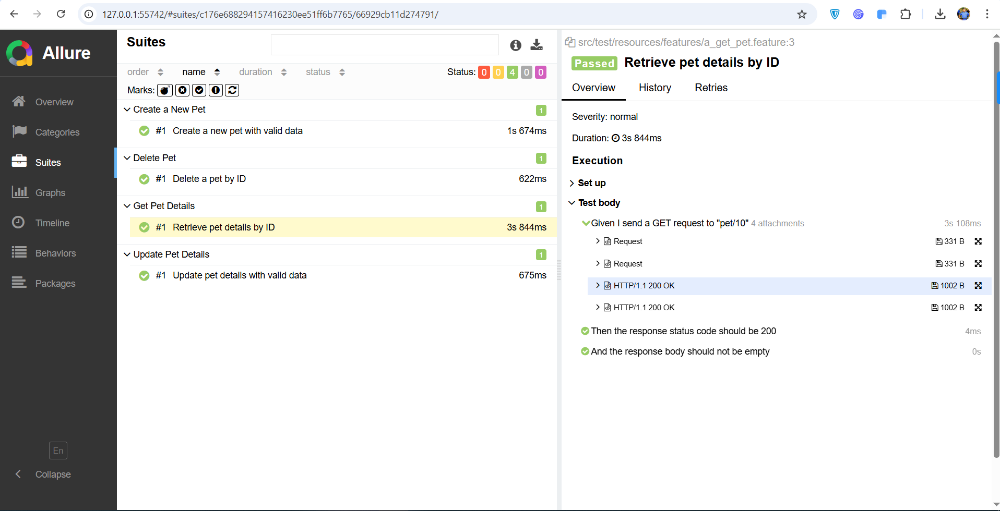
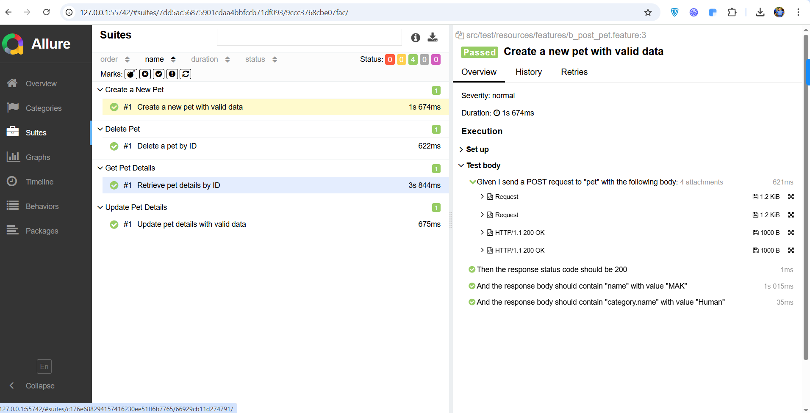
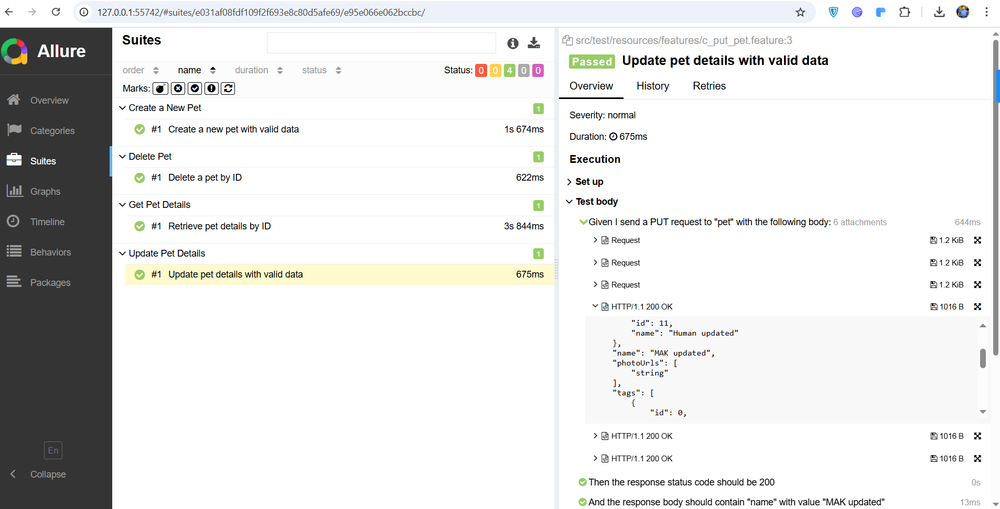
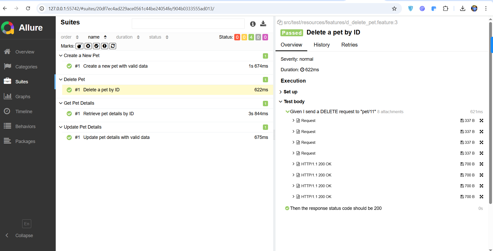

# **Rest Assured API Automation Framework**

## **Overview**

This is a **Rest Assured API Automation Framework** built with Java,
Maven, and Cucumber. It is designed for testing RESTful APIs with
BDD-style scenarios and generates Allure reports.

For API/Swagger details use link :
https://github.com/swagger-api/swagger-petstore

Need to start swagger server before executing testcases.

## **Features**

-   **Rest Assured** for API testing

-   **Cucumber BDD** for behavior-driven development

-   **JUnit** as the test runner

-   **Allure Reports** for test result visualization

-   **Maven** for build management

## **Project Structure**

## **Prerequisites**

Ensure you have the following installed:

-   **Java 23**

-   **Maven**

-   **Allure CLI** (for viewing reports)

## **Installation & Setup**

1.  Clone the repository:

2.  Install dependencies:

3.  Run tests:
    Either hit play in TestRunner file or execute one by one in resources/features.

5.  Generate Allure Report:\
    Allure report can be published my executing \"allure serve
target/allure-results\"

## **Writing New Tests**

-   Define new API endpoints in PetEndPoints.java.

-   Write feature files under src/test/resources/features/.

-   Implement step definitions in stepdefinitions/StepDefinitions.java.

## **Allure Report Results**

